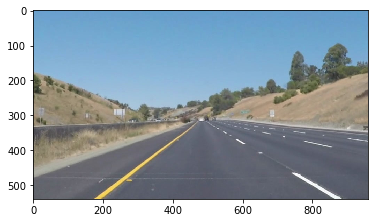
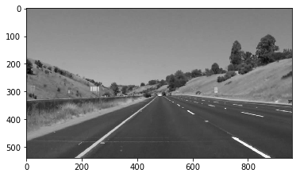
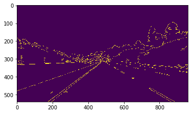
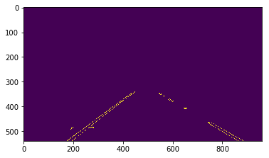
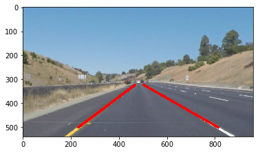

Udacity Self-Driving Car ND
===========================

*Project 1 – Finding Lane Lines on the Road*
============================================

### 

### By David Rose

### 4/3/2017

**Goals: **
===========

-   Build out a re-usable pipeline that can intake image/video and
    output lane border masks.

-   Written Report on my work and findings.

**Reflection:**
---------------

### In the making of this project I finalized on these final steps for the pipeline from image load to output:

1.  **Load image**/video with mpimg.imread().

    1.  

2.  **Resize** to a standard of 960x540.

    1.  I tested finding lanes on images I found online, so I needed to
        get them all the same size first.

3.  Apply the **grayscale** via cv2.

    1.  

4.  Apply the GaussianBlur via cv2.

    1.  Kernel size 3

5.  Apply **Canny edge detection** via cv2, setting thresholds at 50
    and 150.

    1.  

6.  Explicitly **state the 4 corners of the image mask** I will use to
    isolate the lane the car is currently in.

    1.  

7.  Apply the **HoughLinesP function** via cv2 to better isolate the
    specific lines detected and place them in an array for
    easier processing.

8.  **Separate the lanes!**

    1.  Create left and right lane lists.

    2.  **Check the direction of slope** and place in appropriate lane.

        1.  (keep in mind y-axis is reversed)

    3.  Filter out any lines **with slope flatter than +/-0.5**

        1.  Help prevent weird artifacts from popping up.

9.  Create final two lane lines

    1.  **Linear Regression** applied to all points of lines within each
        respective lane to find the best overall fit.

    2.  **Apply common sense**

        1.  **If the slope of a lane goes flatter than 0.5, pull the
            slope of the previous video frame and apply.**

        2.  Repeat until normal lane is detected again.

10. Clip bottom of lanes (possible issues with hood or dashboard in
    some instances).

11. **Draw lanes onto stock image** via cv2.

    1.  

**Shortcomings:**
-----------------

-   Model **assumes relatively straight highway driving.** I attempt to
    filter out flat lines assuming they are useless artifacts, but a
    sharp 90deg turn in the road may become filtered out as well,
    confusing the model.

-   Variables and function arguments are all set after trial and error
    through provided images/video from Udacity. These would **need to be
    re-calibrated if the lighting changes, camera placement changes, or
    driving environment is different enough** from before. This depends
    on good contrast from road surface to painted lane markers.

-   Lane isolated using explicit dimensions, **not ideal in the
    real world.**

**Possible Improvements:**
--------------------------

-   **Run multiple edge detections** with varying settings and
    thresholds, then combine them help balance out specific strengths or
    weaknesses of various road conditions.

-   Rather than restrict detections to specific lane polygon, instead
    **attempt to detect all lane lines as well as road edges,** then
    appropriately detect and understand where the vehicle is located.

-   **Teach the model the concept of turns, merging, etc.** Model could
    realize when it’s time to turn or merge and temporarily enact a
    separate set of assumptions and guidance.

***Optional Challenge:***
-------------------------

### Smooth Lines (averaging):

I tried (with a slight bit of success) to smooth out the line
predictions (slope and intercept) with the idea that one or two errant
frame predictions would not throw it off completely. If the difference
in current prediction was outside of the explicit boundaries I stated
(IE difference from current line slope, to average of previous 10 frames
slopes), then revert back to an average over the last few frames. It
also uses the average for predictions that fall within those boundaries,
but it then appends the current frame prediction into the list of
averages I had built.

The issue is that it likes to linger and not react to curves as quickly
as I would like at the beginning of the video. This is likely because
the list of previous frames is small and skewed more towards the past
than in later frames where it seems to begin working better.
